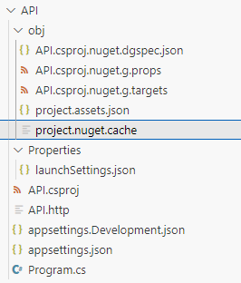

# Dot net project 

To create a new project in dotnet 

```bash
dotnet new <TEMPLATE_TYPE> -n <YourProjectName> -o <OutputDirectoryName>
```

For example, to create a new console application named "MyConsoleApp" in a new folder also named "MyConsoleApp":
```bash
dotnet new console -n MyConsoleApp
```

Or, to specify a different output directory:
```bash
dotnet new console -n MyConsoleApp -o MyProjectFolder
```

This will generate you a folder structure of


```plaintext
MyProject/
├── MyProject.csproj (.csproj | .vbproj | .fsproj)
├── Program.cs
├── Program.sln
├── appsetting.Development.json
├── appsetting.json
├── obj/
│   └── ... (intermediate build files)
└── bin/
    └── ... (compiled output: executables, DLLs)
```
Key generated folders and files include:
-The **Project file (.csproj | .vbproj | .fsproj)** is the file that defines your project settings. 
-The **.cs** is the start of you're source code - entry point to main. 
-The **obj folder** is used by the .NET build process to temporary intermediate files generate during compilation. Build files basically. Leave the folder. 
-The **bin Folder (Binaries Folder)** executable stuff 
-The **properties** This folder is common in many project types, especially web applications and worker services. -Normally having **launchSettings.json** for local development convenience and is not deployed with your application. 


**To import use the using**

```csharp
using MyService.API.Services;
using System;
using System.Collections.Generic;
using System.Linq;
```